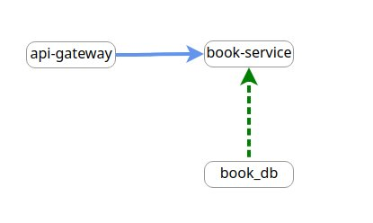
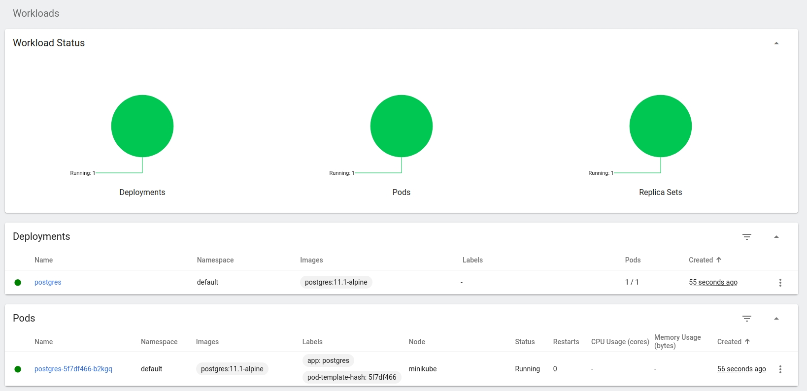
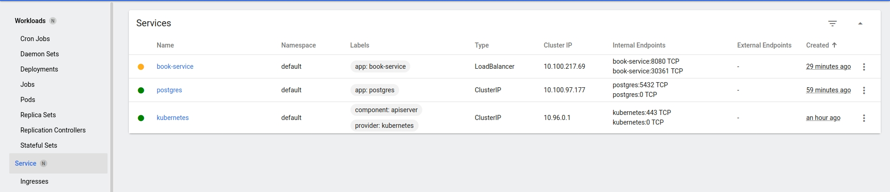
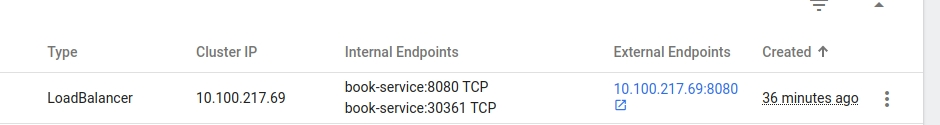
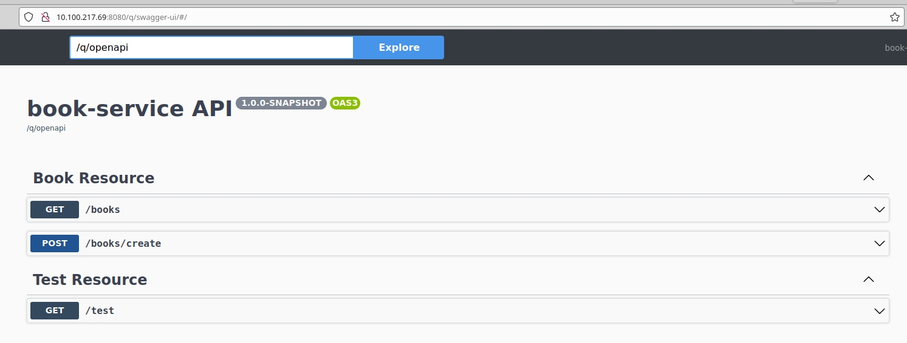
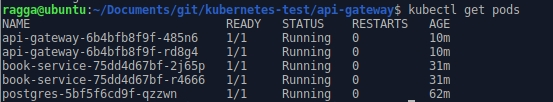
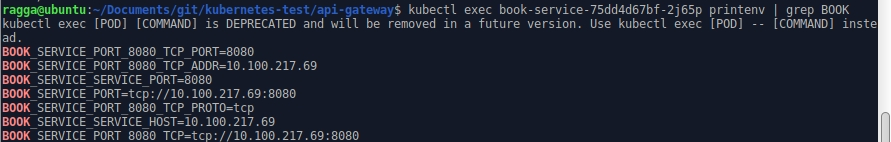
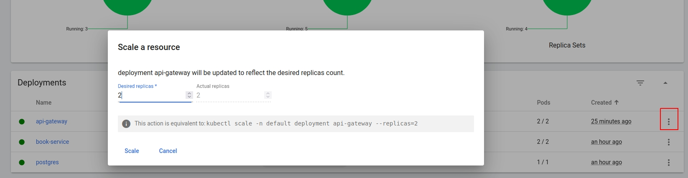

# Kubernetes introduction

In this exercise we are going to deploy simple application to Kubernetes.
This application is made out of two services and one database.
This simple structure lets showcase, how to deploy applications that need to communicate with database and each other.

## What you are going deploy
It is a simple application where users can record books they have read and some note about it, for an example 
if they liked it or not.

Simple scheme looks like this



## What you are going to need
- [Docker](https://docs.docker.com/get-docker/)
- [Kubectl](https://kubernetes.io/docs/tasks/tools/) kubernetes CLI 
- [Minikube](https://minikube.sigs.k8s.io/docs/start/) local cluster
## First steps

Once you have everything prepared begin by starting Minikube

    minikube start

and opening dashboard

    minikube dashboard

## Kubernetes dashboard

This is the place where (almost) all the work is going to be done.
The left panel serves for quickly searching and editing various kubernetes entities.
But since we just started the cluster, there is nothing to be seen.

Lets change that

## Database deployment

First thing our application is going to need is running database. I will be using postgresql in this example.

When creating a database, we need to provide things like, username, name of the database, password and other configuration
details.

It is good practice having these in a separate file. In kubernetes we use something called `ConfigMap`.

#### Database ConfigMap

Click the "plus" button in the top right corner of dashboard. 


Kubernetes is using YAML format for its files same way for example docker compose does.

The `ConfigMap` we are going to be using with our database looks like this 

```yaml

apiVersion: v1
kind: ConfigMap
metadata:
  name: postgres-config
  labels:
    app: postgres
data:
  POSTGRESQL_USER: book_service
  POSTGRESQL_PASSWORD: hunter2
  POSTGRESQL_DATABASE: book_db


```
What do all these things mean?

- `kind` is telling kubernetes what sort of configuration file this is. There are many kinds as you will see.
- `metadata` contains things such as name of the file.
- `data` is a simple `key:value` store for all the required information.

We have our credentials ready, now we need to describe how the database looks.
For this kubernetes uses `Service` files

#### Services

Use the following file

```yaml
apiVersion: v1
kind: Service
metadata:
  name: postgres
  labels:
    app: postgres
spec:
  type: ClusterIP
  ports:
   - port: 5432
  selector:
   app: postgres
```
The `kind` and `metadata` fields are the same as before, however there is new `spec` field.
This portion of the configuration file describes properties of the service, most importantly the `port`
and type of the port.

There are three type of ports in kubernetes

- `ClusterIP` this is the default type. Services with this type of port are only available to other services withing the cluster
- `NodePort` this is one way how to expose the service to the world outside the cluster.
However, this type is usually not recommended as the range of the ports is limited and it is limited to one service.
- `LoadBalancer` this is the standard way how to expose the service to the internet.

We have our service ready, but it still isn't enough. One last thing we need to provide kubernetes is deployment information 

#### Deployments

These type of files are used to tell kubernetes how you would like to deploy the service

Take a look at the following file

```yaml
apiVersion: apps/v1
kind: Deployment
metadata:
  name: postgres
spec:
  replicas: 1
  selector:
    matchLabels:
      app: postgres
  template:
    metadata:
      labels:
        app: postgres
    spec:
      containers:
        - name: postgres
          image: centos/postgresql-96-centos7
          ports:
            - containerPort: 5432
          envFrom:
            - configMapRef:
                name: postgres-config
```

Some fields are already familiar to you there are a couple of new names.
The `spec` section has `replicas` property. This is where we specify how many instance we want to run(more on that later).
There is also a template section with its own `spec`. This where we need to specify what image is our deployment going to use,
and math the service port. You can also see that `envFrom` is going to use the credentials from a file we created earlier.


Our database is finally ready, and you see it is up and running



Now we can deploy our `book-service`.

## Book service

You can take a look how this service looks in the git repository.
It is simple Quarkus application with few REST endpoints. For this demonstration it has already been 
built and uploaded to dockerhub se we can use it straight away.

The process is similar to the database deployment.

First we need service file

```yaml
apiVersion: v1
kind: Service
metadata:
  name: book-service
  labels:
    app: book-service
spec:
  type: LoadBalancer
  ports:
  - port: 8080
    protocol: TCP
  selector:
    app: book-service
```
there is nothing new in this file a part from `LoadBalancer` type. This is important as we want to connect to this service
using our browser.

Deployment is again similar 

```yaml
apiVersion: apps/v1
kind: Deployment
metadata:
  name: book-service
  labels:
    app: book-service
spec:
  replicas: 2
  selector:
    matchLabels:
      app: book-service
  template:
    metadata:
      labels:
        app: book-service
    spec:
      containers:
      - name: book-service
        image: ragga57/book-service:latest
        ports:
        - containerPort: 8080
        resources:
          limits:
            cpu: 500m
          requests:
            cpu: 200m
```
This time we want two instances instead of that is why `replicas: 2`.
We also want to limit the resource usage since this is our first service that is going to be available to the outside world.
This is described in the `resources` property.

Our deployments are ready and should be reachable however there is still a small issue. As you can see in the service section,
`book-service` still does not have external IP.




That is Minikube specific problem, so we need to run the following command in separate terminal

    minikube tunnel

to simulate external IP. Now you should see it



Click it and go to `/q/swagger-ui`

The service is ready to operate. Try it out.




## Api gateway

Our service is working but if you have more than one service it is not a good idea to expose all of them.
That is why you usually have api gateways to expose only some services or only some functionalities.


Click on the service in kubernetes dashboard and change the port type to `ClusterIP`.
The external IP is now missing but that is ok.

Use the same steps and YAML configs as in the case of `book-service` but instead call it `api-gateway`,
user port `8081` and image `ragga57/api-gateway:latest`


Once it is ready. open the website again an go to `/q/swagger-ui`.


Although the site looks the same all the traffic now goes through this gateway which makes it much more simple to restrict certain,
functionalities, handle security and so on.


## Networking

You might be wondering how the services know where the other services are, what address to call.
On local machine it is simple and you can use `localhost:[port]` but in cloud, where this does not work.

Luckily kubernetes handles service discovery for you no matter how many entities you have.

Take a look how `api-gateway` knows where `book-service` is 

    kubectl get pods



these are all the enviroment varaibles that kubernetes takes track of about `book-service`

    kubectl exec book-service-75dd4d67bf-2j65p printenv

and these are the important ones
    
    kubectl exec book-service-75dd4d67bf-2j65p printenv | grep BOOK



The variable `BOOK_SERVICE_SERVICE_HOST` keeps tract about the current IP address.

If you take a look at the file `application.properties` gateway uses this to connect to `book-service`

    # book service 
    book-service/mp-rest/url=http://${BOOK_SERVICE_SERVICE_HOST}:8080/
    book-service/mp-rest/scope=javax.inject.Singleton


and `book-service`
is using the same way to connect to the database

    quarkus.datasource.jdbc.url=jdbc:postgresql://${POSTGRES_SERVICE_HOST}:5432/book_db


## Scaling

Kubernetes makes it easy to scale almost instantaneously.
You already saw how to set the number of replicas in deployment.
You can also update the count from the UI



or you can you automatic horizontal pod autoscaling based on some parameters.

## Disclamer 
This process is little more involved and might not be straight forward on some machines.
This is why this section is just a bonus I leave link here that helped me to get to work but might not others.


#### Horizontal pod autoscaling
First check if you have enabled `metrics-server`

    minikube addons list
    minikube addons enable metrics-server

if you dont have it installed you can install it from [here](https://github.com/kubernetes-sigs/metrics-server#readme)

then upload this file 

````yaml
apiVersion: autoscaling/v1
kind: HorizontalPodAutoscaler
metadata:
 name: api-gateway
spec:
 scaleTargetRef:
   apiVersion: apps/v1
   kind: Deployment
   name: api-gateway
 minReplicas: 1
 maxReplicas: 3
 targetCPUUtilizationPercentage: 50
````
This file sets the minimum number of instances, maximum and the decision-making rule, whether to scale up or down.
In this example it is based on CPU usage.


You might need to set up extra configs for the metrics server. I don't know exactly which ones will work on your machine,
so I will just leave the link here.

Official documentation [here](https://kubernetes.io/docs/tasks/run-application/horizontal-pod-autoscale-walkthrough/) 

Troubleshooting [here](https://github.com/kubernetes-sigs/metrics-server/issues/212)


 

